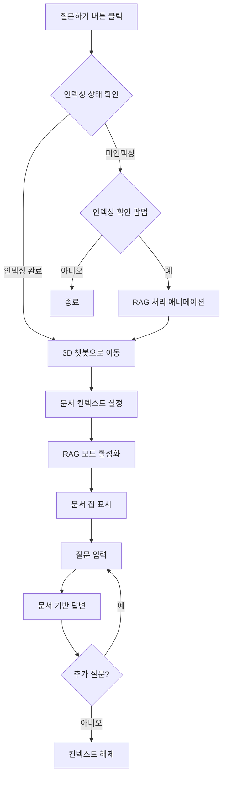

# RAG 문서 관리 시스템 가이드

> **최종 업데이트**: 2024-12-31  
> **난이도**: ⭐⭐ 중급  
> **중요도**: 🔥 필수  
> **버전**: 3.5

## 📋 목차

1. [개요](#개요)
2. [주요 기능](#주요-기능)
3. [시각화 애니메이션](#시각화-애니메이션)
4. [사용 방법](#사용-방법)
5. [API 엔드포인트](#api-엔드포인트)
6. [문서에 질문하기](#문서에-질문하기)
7. [기술 구현](#기술-구현)
8. [트러블슈팅](#트러블슈팅)

---

## 개요

RAG(Retrieval-Augmented Generation) 문서 관리 시스템은 문서를 업로드하고, 자동으로 인덱싱하여, 문서 내용에 대해 자연어로 질문할 수 있는 AI 기반 지식 관리 시스템입니다.

### 핵심 특징

- 🎨 **시각화된 처리 과정**: Parsing → Chunking → Embedding → Indexing 단계를 애니메이션으로 표시
- 📚 **문서별 질문 기능**: 특정 문서에 대해 집중적으로 질문 가능
- 🔗 **3D 챗봇 통합**: 예진이 3D 챗봇과 완벽 통합
- 🎯 **컨텍스트 표시**: 현재 대화 중인 문서를 칩으로 명시

---

## 주요 기능

### 1. 문서 업로드 및 RAG 인덱싱

```
파일 선택 → RAG 인덱싱 여부 선택 → 애니메이션 모달 표시 → 인덱싱 완료
```

**지원 파일 형식**:
- PDF (`.pdf`)
- Word (`.docx`, `.doc`)
- 텍스트 (`.txt`)
- PowerPoint (`.pptx`, `.ppt`)
- Excel (`.xlsx`, `.xls`)

**최대 파일 크기**: 100MB

### 2. 문서에 질문하기

각 문서 옆에 **"질문하기"** 버튼이 표시되며, 클릭하면:

1. **인덱싱 상태 확인**
   - ✅ 인덱싱 완료: 바로 3D 챗봇으로 이동
   - ❌ 미인덱싱: 인덱싱 여부 선택 팝업

2. **문서 컨텍스트 설정**
   - 해당 문서가 대화의 중심이 됨
   - RAG 모드 자동 활성화
   - 문서 칩으로 현재 문서 표시

3. **질문 및 답변**
   - 문서 내용 기반 답변
   - 출처 및 유사도 표시

### 3. 문서 컨텍스트 관리

**문서 칩 표시**:
```
[📄 대상 문서: example.pdf] [×]
```

- **위치**: 채팅 창 상단
- **기능**: 현재 대화 중인 문서 명시
- **제거**: `×` 버튼 클릭 또는 `clearDocumentContext()` 호출

---

## 시각화 애니메이션

### 모달 구조

```
┌──────────────────────────────────────────┐
│  🧠 지식 베이스 최적화 중...             │ ← 맥동 애니메이션
├──────────────────────────────────────────┤
│                                          │
│     [그래픽 영역 - 4단계 애니메이션]     │
│                                          │
├──────────────────────────────────────────┤
│  진행 상태: 50%                          │
│  ████████████░░░░░░░░░░░░ 50%           │ ← 그라데이션 프로그레스바
│  현재 42번째 조각 임베딩 중...           │
└──────────────────────────────────────────┘
```

### 4단계 시각화

#### 1️⃣ **Parsing (문서 분석)**
- 📄 문서 아이콘
- ➡️ 빛의 선 (light beams)
- 📝 텍스트 레이어로 분리

```
🗎 → ━━━ → 📝
        ━━━    📝
        ━━━    📝
```

**애니메이션**: 
- `lightBeam`: 빛의 선이 좌우로 흐름
- `layerSeparate`: 텍스트 층이 오른쪽으로 분리

#### 2️⃣ **Chunking (의미 단위 분할)**
- 🧩 정육면체 블록 6개
- 공중에 떠다니며 회전
- 색상: 보라색 그라데이션

```
 📦    📦    📦
   📦    📦    📦
```

**애니메이션**: 
- `chunkFloat`: 상하좌우로 부유하며 360도 회전

#### 3️⃣ **Embedding (벡터 변환)**
- 0과 1로 이루어진 이진 코드 스트림
- 좌측에서 우측 상단으로 흐름
- 사이언 글로우 효과

```
01001000 → → →
   01100101 → → →
      01101100 → → →
```

**애니메이션**: 
- `codeFlow`: 왼쪽에서 오른쪽으로 이동하며 위로 상승

#### 4️⃣ **Indexing (벡터 공간 저장)**
- 🗂️ 다차원 격자 (Grid)
- 🔵 벡터 포인트가 격자에 정착
- 초록색 글로우 효과

```
┌───┼───┼───┐
│ ● │   │ ● │
├───┼───┼───┤
│   │ ● │   │
├───┼───┼───┤
│ ● │   │   │
└───┼───┼───┘
```

**애니메이션**: 
- `gridAppear`: 격자선이 좌우로 펼쳐짐
- `pointSettle`: 벡터 포인트가 회전하며 정착

### 애니메이션 타이밍

| 단계 | 지속 시간 | 설명 |
|------|----------|------|
| Parsing | 3초 | 문서 구조 분석 |
| Chunking | 3초 | 의미 단위 분할 |
| Embedding | 3초 | 벡터 변환 |
| Indexing | 3초 | 벡터 DB 저장 |
| **총 시간** | **12초** | **완료 메시지 2초 추가** |

---

## 사용 방법

### 1. 문서 업로드

#### 프론트엔드

1. **문서 관리 페이지 접속**
   ```
   메뉴 → 강의 → 문서 관리 (RAG)
   ```

2. **파일 선택**
   - "파일 선택" 버튼 클릭
   - 지원 형식 파일 선택

3. **RAG 인덱싱 여부 선택**
   ```javascript
   ✅ 예: 문서 내용을 학습하고 질문에 답변할 수 있습니다
   ❌ 아니오: 단순히 파일만 저장합니다
   ```

4. **애니메이션 모달 관찰**
   - 4단계 처리 과정 시각화
   - 진행률 및 상태 메시지 확인

5. **완료**
   ```
   ✨ 문서가 성공적으로 업로드되고 RAG 시스템에 인덱싱되었습니다!
   ```

### 2. 문서에 질문하기

#### 방법 1: 문서 목록에서 직접

```javascript
1. 문서 관리 페이지에서 원하는 문서 찾기
2. "질문하기" 버튼 클릭
3. 자동으로 3D 챗봇으로 이동
4. RAG 모드 자동 활성화
5. 문서 칩 확인: [📄 대상 문서: example.pdf]
6. 질문 입력 및 답변 수신
```

#### 방법 2: 챗봇에서 수동 설정

```javascript
// 프로그래매틱하게 문서 컨텍스트 설정
sessionStorage.setItem('chatbot-document-context', 'example.pdf');

// 3D 챗봇 페이지로 이동
showTab('aesong-3d-chat');

// 문서 칩 업데이트
setTimeout(() => {
    updateChatbotDocumentContext('example.pdf');
}, 500);
```

### 3. 문서 컨텍스트 해제

```javascript
// 방법 1: 문서 칩의 × 버튼 클릭

// 방법 2: 프로그래매틱하게
clearDocumentContext();
```

---

## API 엔드포인트

### 1. 문서 업로드

```http
POST /api/documents/upload
Content-Type: multipart/form-data

Body:
  - file: 업로드할 파일
  - category: 'general' (선택)
```

**응답**:
```json
{
  "success": true,
  "message": "문서가 성공적으로 업로드되었습니다",
  "filename": "20241231_143022_example.pdf",
  "original_filename": "example.pdf",
  "file_size": 1024000,
  "file_path": "./documents/20241231_143022_example.pdf",
  "category": "general",
  "upload_date": "2024-12-31T14:30:22"
}
```

### 2. RAG 인덱싱

```http
POST /api/rag/index-document
Content-Type: application/json

Body:
{
  "filename": "20241231_143022_example.pdf",
  "original_filename": "example.pdf"
}
```

**응답**:
```json
{
  "success": true,
  "message": "문서가 RAG 시스템에 성공적으로 인덱싱되었습니다",
  "filename": "20241231_143022_example.pdf",
  "chunks_count": 42,
  "vector_count": 42,
  "metadata": {
    "filename": "20241231_143022_example.pdf",
    "original_filename": "example.pdf",
    "indexed_at": "2024-12-31T14:30:35",
    "file_size": 1024000,
    "source": "documents_folder"
  }
}
```

### 3. 인덱싱 상태 확인

```http
GET /api/rag/document-status/{filename}
```

**응답**:
```json
{
  "success": true,
  "filename": "example.pdf",
  "indexed": true,
  "chunk_count": 42,
  "total_docs_in_rag": 128
}
```

### 4. RAG 채팅 (문서 컨텍스트 포함)

```http
POST /api/rag/chat
Content-Type: application/json
X-GROQ-API-Key: gsk_...

Body:
{
  "message": "이 문서의 주요 내용은?",
  "k": 10,
  "model": "groq",
  "document_context": "example.pdf"
}
```

**응답**:
```json
{
  "success": true,
  "model": "groq",
  "answer": "이 문서는 RAG 시스템에 대한 가이드로...",
  "sources": [
    {
      "content": "...",
      "metadata": {
        "filename": "example.pdf",
        "page": 1
      },
      "similarity": 0.95,
      "source": "example.pdf (페이지 1)"
    }
  ],
  "message": "이 문서의 주요 내용은?",
  "document_context": "example.pdf",
  "query_type": "rag"
}
```

### 5. 문서 목록 조회

```http
GET /api/documents/list
```

**응답**:
```json
{
  "success": true,
  "documents": [
    {
      "filename": "20241231_143022_example.pdf",
      "file_size": 1024000,
      "file_size_mb": 0.98,
      "modified_at": "2024-12-31T14:30:22",
      "extension": ".pdf"
    }
  ],
  "count": 1
}
```

---

## 문서에 질문하기

### 워크플로우



### 코드 예제

#### 프론트엔드: 질문하기 버튼

```javascript
async function askDocument(filename) {
    try {
        // 1. 인덱싱 상태 확인
        const response = await axios.get(
            `${API_BASE_URL}/api/rag/document-status/${encodeURIComponent(filename)}`
        );
        const isIndexed = response.data.indexed;
        
        if (!isIndexed) {
            // 2. 미인덱싱 시 확인 팝업
            if (confirm('이 문서는 아직 RAG 시스템에 인덱싱되지 않았습니다. 지금 인덱싱하시겠습니까?')) {
                // 파일 다운로드 후 재업로드
                const fileBlob = await axios.get(
                    `${API_BASE_URL}/api/documents/download/${encodeURIComponent(filename)}`, 
                    { responseType: 'blob' }
                );
                const file = new File([fileBlob.data], filename);
                await processRAGDocument(file);
            }
            return;
        }
        
        // 3. 문서 컨텍스트 설정
        sessionStorage.setItem('chatbot-document-context', filename);
        
        // 4. 3D 챗봇으로 이동
        showTab('aesong-3d-chat');
        
        // 5. 문서 칩 표시
        setTimeout(() => {
            updateChatbotDocumentContext(filename);
        }, 500);
        
    } catch (error) {
        console.error('문서 상태 확인 실패:', error);
        alert('문서 상태를 확인할 수 없습니다.');
    }
}
```

#### 프론트엔드: RAG 채팅

```javascript
window.sendChatMessage = async function() {
    const message = input.value.trim();
    const useRAG = ragToggle.checked;
    
    // 문서 컨텍스트 가져오기
    const documentContext = sessionStorage.getItem('chatbot-document-context');
    
    if (useRAG) {
        const requestBody = {
            message: message,
            k: 10
        };
        
        // 문서 컨텍스트가 있으면 추가
        if (documentContext) {
            requestBody.document_context = documentContext;
        }
        
        const response = await axios.post(`${API_BASE_URL}/api/rag/chat`, requestBody);
        
        // 답변 표시 (출처 포함)
        appendChatMessage(response.data.answer, 'bot', false, false, response.data.sources);
    }
};
```

#### 백엔드: 문서 필터링

```python
@app.post("/api/rag/chat")
async def rag_chat(request: Request):
    data = await request.json()
    message = data.get('message', '').strip()
    document_context = data.get('document_context', None)
    
    # RAG 체인으로 질문 처리
    rag_chain = RAGChain(vector_store_manager, api_key, api_type)
    result = await rag_chain.query(message, k=k, min_similarity=0.008)
    
    # 문서 컨텍스트가 지정된 경우 결과 필터링
    if document_context:
        filtered_sources = []
        for source in result.get('sources', []):
            metadata = source.get('metadata', {})
            source_filename = metadata.get('filename', '') or metadata.get('original_filename', '')
            
            if document_context in source_filename or source_filename in document_context:
                filtered_sources.append(source)
        
        if filtered_sources:
            result['sources'] = filtered_sources
    
    return {
        "success": True,
        "answer": result['answer'],
        "sources": result['sources'],
        "document_context": document_context
    }
```

---

## 기술 구현

### 프론트엔드 기술

#### 1. 모달 애니메이션

**CSS 키프레임**:

```css
@keyframes pulse {
    0%, 100% { opacity: 1; transform: scale(1); }
    50% { opacity: 0.8; transform: scale(1.05); }
}

@keyframes lightBeam {
    0% { opacity: 0; transform: scaleX(0); }
    50% { opacity: 1; transform: scaleX(1); }
    100% { opacity: 0; transform: scaleX(1.2); }
}

@keyframes chunkFloat {
    0%, 100% { transform: translateY(0) rotate(0deg); }
    25% { transform: translateY(-30px) rotate(90deg); }
    50% { transform: translateY(-20px) rotate(180deg); }
    75% { transform: translateY(-40px) rotate(270deg); }
}

@keyframes codeFlow {
    0% { transform: translateX(-100%) translateY(0); opacity: 0; }
    50% { opacity: 1; }
    100% { transform: translateX(200%) translateY(-100px); opacity: 0; }
}

@keyframes gridAppear {
    0% { opacity: 0; transform: scaleX(0); }
    100% { opacity: 1; transform: scaleX(1); }
}

@keyframes pointSettle {
    0% { opacity: 0; transform: scale(0) rotate(0deg); }
    50% { opacity: 1; transform: scale(1.5) rotate(180deg); }
    100% { opacity: 1; transform: scale(1) rotate(360deg); }
}
```

#### 2. 단계별 전환

```javascript
async function processRAGDocument(file) {
    showRAGProcessingModal();
    
    const stages = ['parsing', 'chunking', 'embedding', 'indexing'];
    let currentStage = 0;
    
    const stageInterval = setInterval(() => {
        // 이전 스테이지 숨기기
        stages.forEach(s => {
            document.getElementById(`stage-${s}`).classList.add('hidden');
        });
        
        // 현재 스테이지 표시
        if (currentStage < stages.length) {
            const stageName = stages[currentStage];
            document.getElementById(`stage-${stageName}`).classList.remove('hidden');
            
            // 진행률 업데이트
            const progress = ((currentStage + 1) / stages.length) * 100;
            document.getElementById('rag-progress-bar').style.width = `${progress}%`;
            
            currentStage++;
        }
    }, 3000); // 각 스테이지 3초
    
    // 실제 업로드 및 인덱싱
    await performRAGIndexing(file);
    
    clearInterval(stageInterval);
    hideRAGProcessingModal();
}
```

### 백엔드 기술

#### 1. 문서 로더

```python
from backend.rag.document_loader import DocumentLoader

document_loader = DocumentLoader(chunk_size=1000, chunk_overlap=200)

# 문서 로드 및 청킹
documents = document_loader.load_document(file_path, metadata)
```

#### 2. 벡터 스토어

```python
from backend.rag.vector_store_manager import VectorStoreManager

vector_store_manager = VectorStoreManager(
    persist_directory="./backend/vector_db",
    collection_name="biohealth_docs"
)

# 벡터 DB에 저장
texts = [doc.page_content for doc in documents]
metadatas = [doc.metadata for doc in documents]
doc_ids = vector_store_manager.add_documents(texts, metadatas)
```

#### 3. RAG 체인

```python
from backend.rag.rag_chain import RAGChain

rag_chain = RAGChain(vector_store_manager, groq_api_key, 'groq')

# 질문 처리
result = await rag_chain.query(message, k=10, min_similarity=0.008)
```

---

## 트러블슈팅

### 1. 모달이 표시되지 않음

**증상**: 문서 업로드 시 애니메이션 모달이 나타나지 않음

**원인**:
- `showRAGProcessingModal()` 함수가 호출되지 않음
- DOM 요소 생성 실패

**해결**:
```javascript
// 브라우저 콘솔에서 확인
console.log(typeof showRAGProcessingModal); // function 이어야 함

// 모달 수동 표시
showRAGProcessingModal();

// DOM에 모달이 추가되었는지 확인
console.log(document.getElementById('rag-processing-modal'));
```

### 2. RAG 인덱싱 실패

**증상**: 문서 업로드는 성공하지만 RAG 인덱싱이 실패

**원인**:
- RAG 시스템 미초기화
- 지원하지 않는 파일 형식
- 문서에서 텍스트 추출 실패

**해결**:
```python
# 백엔드 로그 확인
# [ERROR] RAG 인덱싱 실패: ...

# RAG 시스템 상태 확인
GET /api/rag/status

# 지원 형식 확인
# PDF, DOCX, TXT만 RAG 인덱싱 지원
```

### 3. 문서 컨텍스트가 적용되지 않음

**증상**: "질문하기" 버튼 클릭 후 일반 RAG 답변만 받음

**원인**:
- sessionStorage에 컨텍스트 저장 실패
- 백엔드에 `document_context` 전달 안됨

**해결**:
```javascript
// sessionStorage 확인
console.log(sessionStorage.getItem('chatbot-document-context'));

// 문서 칩이 표시되는지 확인
console.log(document.getElementById('document-context-chip'));

// 요청 body 확인 (네트워크 탭)
// { message: "...", document_context: "example.pdf", k: 10 }
```

### 4. 문서 칩이 표시되지 않음

**증상**: 3D 챗봇에서 문서 칩이 나타나지 않음

**원인**:
- 채팅 컨테이너를 찾을 수 없음
- `updateChatbotDocumentContext()` 호출 타이밍 문제

**해결**:
```javascript
// 컨테이너 확인
const container = document.getElementById('aesong-chat-messages') ||
                 document.getElementById('chat-messages-container');
console.log(container); // null이 아니어야 함

// 수동으로 칩 표시
setTimeout(() => {
    updateChatbotDocumentContext('example.pdf');
}, 1000); // 지연 시간 증가
```

### 5. 애니메이션이 끊김

**증상**: 모달 애니메이션이 부드럽게 재생되지 않음

**원인**:
- CSS 애니메이션 충돌
- 브라우저 성능 문제
- GPU 가속 미지원

**해결**:
```css
/* GPU 가속 활성화 */
.stage-container {
    transform: translateZ(0);
    will-change: opacity, transform;
}

/* 애니메이션 성능 최적화 */
@keyframes optimizedFloat {
    0%, 100% { transform: translate3d(0, 0, 0); }
    50% { transform: translate3d(0, -20px, 0); }
}
```

### 6. 문서 검색 결과가 없음

**증상**: 문서를 질문해도 관련 내용을 찾지 못함

**원인**:
- 유사도 임계값이 너무 높음
- 임베딩 품질 문제
- 문서가 실제로 인덱싱되지 않음

**해결**:
```python
# 유사도 임계값 조정
result = await rag_chain.query(message, k=10, min_similarity=0.005)  # 0.008 → 0.005

# 문서 개수 확인
GET /api/rag/document-status/{filename}
# { "indexed": true, "chunk_count": 42 }

# 전체 RAG 문서 수 확인
GET /api/rag/status
```

---

## 관련 문서

- [RAG_SYSTEM_GUIDE.md](./RAG_SYSTEM_GUIDE.md) - RAG 시스템 전체 가이드
- [API_SUMMARY.md](./API_SUMMARY.md) - API 엔드포인트 전체 목록
- [IMPLEMENTATION_SUMMARY.md](./IMPLEMENTATION_SUMMARY.md) - 구현 요약
- [LOCAL_DEVELOPMENT.md](./LOCAL_DEVELOPMENT.md) - 로컬 개발 환경 설정

---

## 라이선스

© 2024 BH2025 WOWU. All rights reserved.
